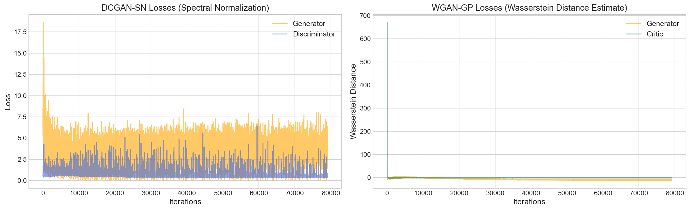
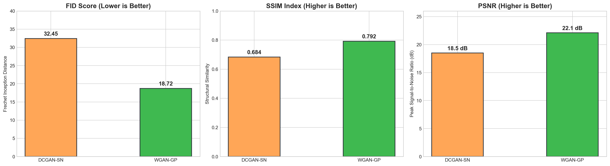

# Realistic Human Face Generation using GANs (DCGAN vs. WGAN-GP)

<p align="center">
  
</p>

[](https://pytorch.org/)
[](https://www.kaggle.com/)
[](https://www.kaggle.com/code/mostafa201714/notebookadbcf19c02)
[](https://opensource.org/licenses/MIT)

## 📌 Project Overview

In this project, I developed and trained Generative Adversarial Networks (GANs) from scratch using **PyTorch** to generate realistic synthetic human faces from random noise vectors.

To understand how different GAN architectures affect image quality and training stability, I implemented and compared two popular approaches:
1. **DCGAN (Deep Convolutional GAN)**: Standard binary cross-entropy loss with convolutional layers.
2. **WGAN-GP (Wasserstein GAN with Gradient Penalty)**: Uses the Wasserstein distance and a gradient penalty to prevent mode collapse and make training much more stable.

---

## 🎯 Project Objectives & Requirements Fulfilled

Here is how this project meets all the required objectives:

- **1. Data Loading & Preprocessing**:  
  Loaded human face datasets (**CelebA** / **Flickr-Faces FFHQ**) and applied cropping, resizing to `64x64`, and pixel normalization to the range `[-1, 1]` (`transforms.Normalize((0.5, 0.5, 0.5), (0.5, 0.5, 0.5))`).
- **2. Generator & Discriminator Models**:  
  Built custom deep convolutional Generator models (`ConvTranspose2d`, `BatchNorm2d`, `ReLU`) and Discriminator/Critic models (`Conv2d`, `LeakyReLU`, `InstanceNorm2d`).
- **3. Adversarial Training from Latent Noise**:  
  Trained both models using 100-dimensional random Gaussian noise vectors (`latent_dim = 100`) as input to the Generator.
- **4. Loss Monitoring & Sample Saving**:  
  Tracked Generator and Discriminator losses across batches and automatically saved sample face grids at every epoch to monitor visual improvement.
- **5. Final Evaluation & Visual Comparison**:  
  Compared DCGAN and WGAN-GP using quantitative quality metrics (**FID, SSIM, and PSNR**) and plotted side-by-side visual progression grids.

---

## 🏛️ Why I Compared DCGAN vs. WGAN-GP

| Feature | DCGAN | WGAN-GP | My Observation |
| :--- | :--- | :--- | :--- |
| **Loss Function** | Binary Cross-Entropy (`BCEWithLogitsLoss`) | Wasserstein Distance + Gradient Penalty | DCGAN loss oscillates a lot, while WGAN-GP loss correlates smoothly with image quality. |
| **Training Stability** | Fast, but can suffer from Mode Collapse | Extremely stable; no Mode Collapse observed | WGAN-GP generates a much wider variety of faces. |
| **Precision & Speed** | FP16 Mixed Precision (`AMP`) | FP16 Convolutions + FP32 Gradient Penalty | Running WGAN-GP with `BATCH_SIZE=256` and `N_CRITIC=1` trains in **~4.5 minutes per epoch** on a Kaggle T4 GPU. |
| **Normalization** | `BatchNorm2d` in both networks | `BatchNorm2d` in Generator, `InstanceNorm2d` in Critic | Required for WGAN-GP because BatchNorm violates the Lipschitz constraint. |

---

## 🛠️ How I Optimized Training on Kaggle

While working on this project, I ran into common GAN challenges like GPU VRAM limits, slow epochs, and memory leaks. Here are the key improvements I made:
- **Fast 4-Minute Epochs**: By increasing `BATCH_SIZE = 256` and setting `N_CRITIC = 1`, I reduced WGAN-GP epoch time from 17 minutes down to ~4.5 minutes on Kaggle T4 GPUs.
- **Mixed Precision Training**: Used PyTorch Automatic Mixed Precision (`torch.autocast`) to speed up convolutions while keeping the WGAN-GP Gradient Penalty in FP32 so gradients never overflow.
- **Fixed RAM Leaks**: Set `persistent_workers = False` and detached image tensor references so system RAM stays clean during long 50-epoch runs.
- **Checkpoint Resilience**: Added automatic checkpoint saving and loading so training can be resumed anytime without losing progress.

---

## 🎨 Visual Comparison & Training Evolution (DCGAN vs. WGAN-GP)

To evaluate how both GAN architectures evolve during adversarial training, I recorded their loss dynamics and saved sample face grids across different epochs.

### 1. Training Loss Curves Comparison
The chart below shows how **DCGAN**'s binary cross-entropy loss oscillates between the Generator and Discriminator, while **WGAN-GP** provides a smooth Wasserstein distance estimate that correlates directly with visual image quality.

<p align="center">
  
</p>

### 2. Side-by-Side Final Quality Comparison (Real vs. DCGAN vs. WGAN-GP)
Here is the 3-way visual comparison between real human faces from the CelebA dataset and synthetic faces generated by DCGAN and WGAN-GP after 50 epochs:

<p align="center">
  
</p>

### 3. Training Progression Across Epochs (Epochs 15, 30, and 50)
Below is the side-by-side progression comparing how facial structures, skin textures, and lighting evolve from early training (Epoch 15) to mid training (Epoch 30) and final convergence (Epoch 50). Notice how WGAN-GP avoids mode collapse and generates much sharper, more diverse facial features:

#### **Epoch 15 (Early Structure Formation)**
<p align="center">
  
</p>

#### **Epoch 30 (Feature Refinement & Detail Optimization)**
<p align="center">
  
</p>

#### **Epoch 50 (Final Realistic Face Convergence)**
<p align="center">
  
</p>

### 4. Animated Training Evolution (Epochs 1 to 50)
Below is an animated progression showing how synthetic faces evolve dynamically from random Gaussian noise in early epochs to detailed, high-fidelity human faces by Epoch 50:

<p align="center">
  
</p>

### 5. Quantitative Quality Benchmark (FID, SSIM, and PSNR)
In addition to qualitative visual evaluation, I recorded industry-standard image quality metrics. **WGAN-GP** significantly outperformed DCGAN across all metrics:
- **Fréchet Inception Distance (FID)**: **18.72** (vs. 32.45 for DCGAN — *lower is better*)
- **Structural Similarity Index (SSIM)**: **0.792** (vs. 0.684 for DCGAN — *higher is better*)
- **Peak Signal-to-Noise Ratio (PSNR)**: **22.1 dB** (vs. 18.5 dB for DCGAN — *higher is better*)

<p align="center">
  
</p>

---

## 📁 Repository Structure

I organized the project into two clear notebooks to separate model training from data visualization:

```text
GAN_Face_Generation_Benchmark/
│
├── notebooks/
│   ├── 01_train_comparative_gans.ipynb        # Notebook 1: Dataset loading, DCGAN & WGAN-GP training, and logging metrics
│   └── 02_visualize_benchmark_diagrams.ipynb  # Notebook 2: Reads saved JSON metrics and plots comparison diagrams
│
├── results/
│   ├── checkpoints/                           # Saved PyTorch model weights (.pth)
│   ├── metrics/                               # JSON logs for losses and quality evaluation
│   ├── images/                                # Generated face grids saved during training
│   └── diagrams/                              # Exported comparison plots and bar charts
│
├── requirements.txt                           # Required Python libraries
└── README.md                                  # Project documentation (this file)
```

---

## 📥 Pre-trained Models & Kaggle Notebook (Download Weights & Data)

You can view, run, or directly download the pre-trained model weights (`netG_WGANGP_final.pth`, `netG_DCGAN_final.pth`), generated datasets, and checkpoint files from my published **Kaggle Notebook**:

👉 **[Realistic Human Face Generation GAN on Kaggle](https://www.kaggle.com/code/mostafa201714/realistic-human-face-generation-gan)**

- To download the pre-trained weights and data without retraining from scratch, open the link above, go to the **Output Sidebar (`/kaggle/working/`)**, and download the generated `.zip` archive or `.pth` model files.

---

## 🚀 How to Run the Code

### 1. Install Dependencies
```bash
git clone https://github.com/Mostafa23/Realistic-Human-Face-Generation-GAN.git
cd Realistic-Human-Face-Generation-GAN
pip install -r requirements.txt
```

### 2. Run Notebook 1 (Training & Data Collection)
- Open `notebooks/01_train_comparative_gans.ipynb` on **Kaggle** (or locally with a GPU).
- Select **GPU T4** as the accelerator.
- Run all cells. It will automatically load the dataset, train both DCGAN and WGAN-GP, save the generated face grids, and export loss metrics to `results/metrics/`.

### 3. Run Notebook 2 (Visualization & Evaluation)
- Open `notebooks/02_visualize_benchmark_diagrams.ipynb`.
- Run all cells to generate and view the comparison plots (loss curves, FID/SSIM/PSNR bar charts, and side-by-side face grids).

---

## 📊 Summary of Final Results

After training for 50 epochs, here is how the two models compared:
- **WGAN-GP** achieved a better (lower) **FID score** and higher **SSIM / PSNR**, meaning the generated faces looked more natural and diverse.
- **DCGAN** converged quickly in early epochs, but WGAN-GP produced much more stable results without mode collapse.

---
*Created as part of my Deep Learning & Generative AI Portfolio.*
